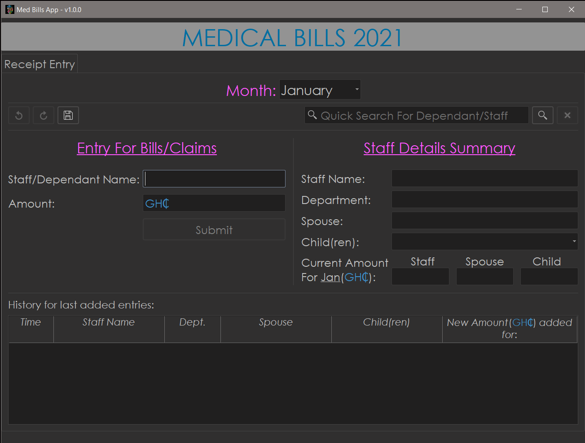
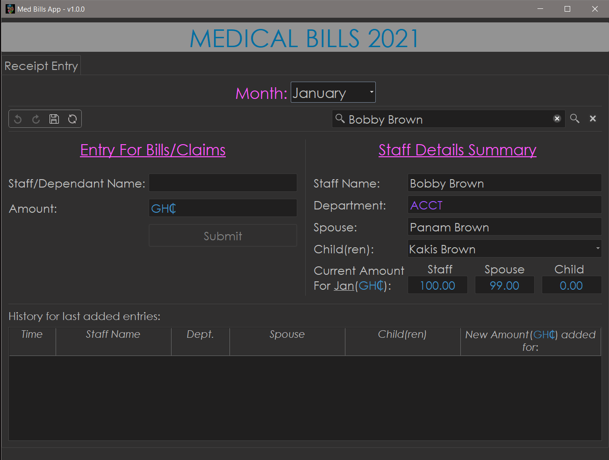

# Medical Bills Entry App v1.0.0
 >App to quickly make entries of medical claims/receipts into a pre-formatted, pre-filled Excel database.

## Requirements:
>- icecream~=2.1.0
>- PyQt5~=5.15.2
>- openpyxl~=3.0.6

## Description:
>- This is a receipt entry app(will be expanded with more capabilities) that makes use of two specific *pre-formatted*
and *pre-filled* databases. It was custom-made to meet the needs of a nurse at a specific organization and most of the
reading and writing operations are **rigid** and will only work properly given the right databases and environments in Excel.

>- It makes use of **two** databases: `STAFF DEPENDANT LIST yyyy.xlsx` and `MEDICAL BILLS yyyy.xlsx`(yyyy => Current Year).
   > The former database contains all the staff names, their spouses, and their children (if they have any) with special spacing,
> while the latter database contains the actual information entered through the app. It also has staff names **only**.
   > The "actual information" stored here is just the amount of money spent on medical bills by a staff, his/her spouse
   > or children for a given month.

>- The reason for two databases is that, sometimes on the physical medicall bills receipt the nurse gets, the name of a
> **dependant**(spouse or child) appears and is not explicitly linked with the actual staff to whom the dependant belongs. Eg: 
> Bob Brown appears with an expense of GHS 100.00; But we don't know whether Bob is a spouse to a staff, or a child of a
> staff. For this reason the first database(`STAFF DEPENDANT LIST yyyy.xlsx`) is utilized to search for Bob and connect him to a staff, say Angela Brown,
> who works in Accounts department. Next, Angela's slot for "husband" will be filled with GHS 100.00 in the second database(`MEDICAL BILLS yyyy.xlsx`).

## Screenshots:

## App Demo:
[Short demo](https://imgur.com/vSu2Jms)

## PS:
> The actual databases used cannot be released **publicly** as they contain **private** information, so I'll have to manipulate it 
> a bit before releasing. It should be known that the app **depends** heavily on the databases to function at all.

## EXCEL DATABASES STRUCTURE:
-- # TODO: Add later

## About:
- Author: Divine Anum
- Contact: tpandivine48@gmail.com
- Version: 1.0.0
- First release: *coming soon* 😅